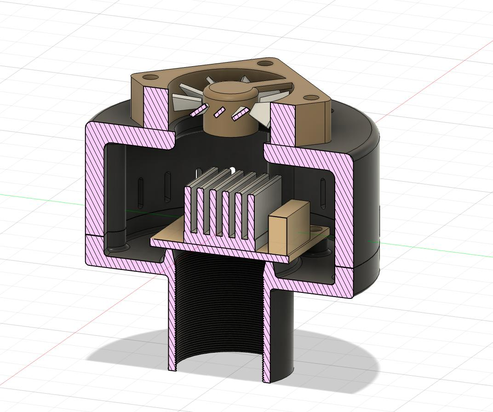
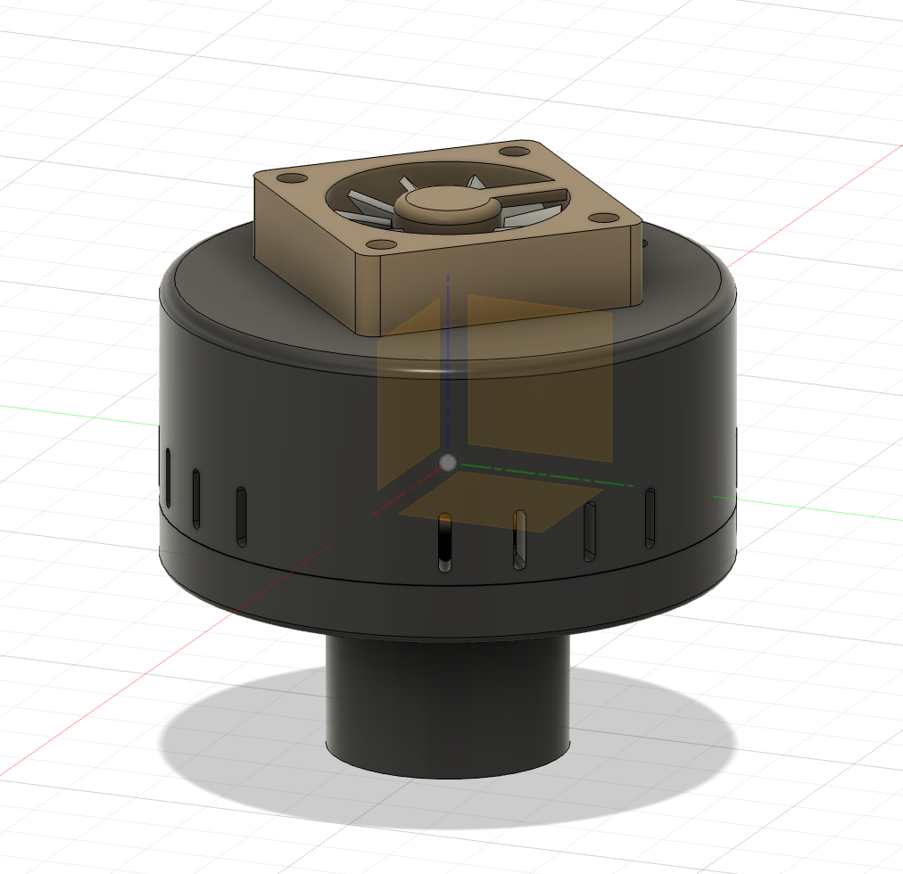
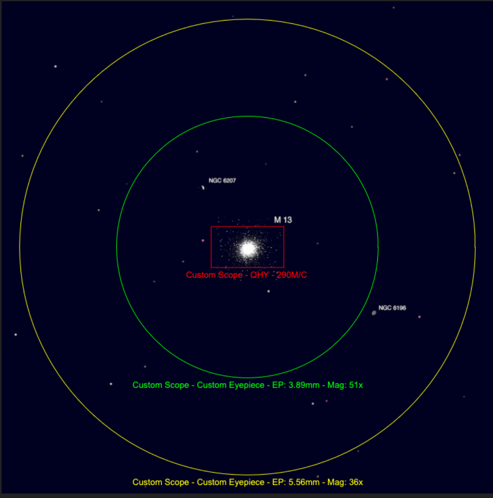

# A basic air-cooled camera for my dobsonian

The goal is to do a bit of live-stacking with my wide-field dobsonian running at f/3.52. The camera is a random IMX291 sensor running as an UVC camera. This should see light sometime in this summer.

Acquisition is done with AstroDMx_Capture and stacking is done with ALS - Astro live stacker.

Here are fields on M13 in my dobsonian with : 
- APM 20MM 100°
- Explore Scientific 14mm 82°
- A sensor with the same dimensions as my IMX291

The visual correction of coma is very satisfying somewhere between the green and the yellow fields, so it should be more than correct on the sensor size. The corrector used is a Baader MPCC Mark III, with my primary mirror properly hyperbolized to counter the corrector-induced spherical aberration.
